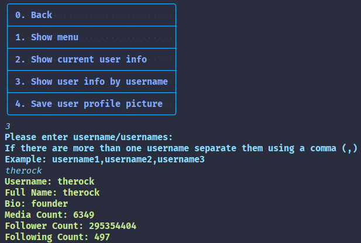
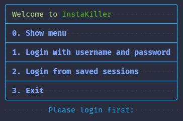
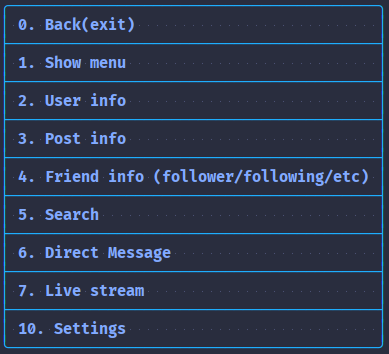

# InstaKiller

**InstaKiller** is a CLI wrapper around [instagram4j](https://github.com/instagram4j/instagram4j) library.
---

| Icon |                Item                 |
|:----:|:-----------------------------------:|
|  📺  |       [**Preview**](#Preview)       |
|  📱  | [**Compatibility**](#Compatibility) |
|  💻  |         [**Usage**](#Usage)         |
|  📩  |      [**Download**](#Download)      |
|  📋  |      [**Features**](#Features)      |
|  ⚖️  |       [**License**](#License)       |

---

## Preview

### Basic user info



### More media

[more here](https://github.com/yamin8000/InstaKiller/tree/master/screenshots)

## Compatibility

**Java8+**, this project is targeted on Java 8 and should be runnable on any Java 8 compatible JVM.

`kotlinOptions.jvmTarget = "1.8"`

However, it's built using `jdk-16.0.2+7-openj9`.

## Usage

#### Disclaimer

> **This project is still in development.**
>
> I am not responsible for any damage to properties of intellectual or otherwise caused by this project,
> or any blocked/locked/restricted Instagram accounts.
>
> Use at your own risk and don't use it for illegal purposes.
> In other words:
> - **don't be an a-hole**
> - **don't be evil**
>
> Nobody is killed in process of creating this project.
>
> This project is in no way has any affiliation, authorization, maintenance, sponsorship from Instagram/Meta.
>
> Contributors are not responsible for any damage caused by this project or any repercussions from Instagram/Meta.

[more here](https://github.com/instagram4j/instagram4j#terms-and-conditions)

#### Login

The first time using **InstaKiller** you have to log in using username and password, after that, your session is stored
in `~/sessions/[username]` folder and if you choose to log in using session you don't have to log in again, and you can
just use one of the saved sessions.



Alternatively, you can use command-line options to log in and skip the login menu.

- Login with username and password using command-line options

```powershell
   java -jar instakiller.jar -login [username] [password]
```

- Log in using session from command-line options

```powershell
   java -jar instakiller.jar -session [session_name]
```

#### Menu

After initial login then you can use various tasks you can find in the menu.



#### Submenus documentation

- User info
- Post info
- Friend info
- Search
- Direct message
- [Live stream](docs/live.md)

[more docs here](docs)

#### Privacy notice

This app will never save your username and password as plain text, in fact, your session is saved using `instagram4j`
library `IGClient` class, if you're concerned about your privacy, you can disable auto-saving of sessions and also
since `instagram4j` is open source, you can double-check
its [code](https://github.com/instagram4j/instagram4j/blob/39635974c391e21a322ab3294275df99d7f75f84/src/main/java/com/github/instagram4j/instagram4j/IGClient.java#L219)
.

### Build

1. Clone the repository

   `git@github.com:yamin8000/InstaKiller.git`
2. Build the project

   `gradle build`
3. Run the project

   `gradle run`
4. Enjoy!

Alternatively, you can download the jar file from the releases section or build it yourself using `shadowJar` task.

## Download

[Releases](https://github.com/yamin8000/InstaKiller/releases)

## Features

### General

- [x] Command line interface
- [x] Command line options
- [x] Colored output

### Requests

#### Login

- [x] Log in with username and password
- [x] Log in using session, Save logged in account session to a file for later use

#### Profile

- [x] See user(other, yourself) profile full info

#### Direct Message

- [x] See your own direct message inbox
- [x] Send a direct message to multiple users

#### Media

- [x] See your own posts
- [ ] See your own stories
- [x] See other user's posts
- [ ] See other user's stories

### Live stream

- [x] Create live stream
- [x] Start your live stream
- [x] Stop your live stream
- [x] See your live stream viewer count
- [x] See your live stream viewer list
- [x] See your live stream comment list
- [x] Add comment to your live stream

#### Friends

- [x] See user(other, yourself) friends (followers, following)
- [x] See user(other, yourself) unfollowers (both ways)

#### Batch download

- [ ] Batch download multiple users posts info to a text file (CSV)
- [x] Batch download multiple users posts pictures
- [ ] Batch download multiple users posts videos
- [ ] Batch download multiple users stories pictures
- [x] Batch download multiple users profile pictures

> default download directory is: "./downloads"

### Actions

#### Search

- [ ] Search for users
- [ ] Search for hashtags
- [ ] Search for locations

#### Account

- [ ] Change your account bio
- [ ] Change your account profile picture

#### Timeline

- [ ] Upload photo
- [ ] Upload photo album
- [ ] Upload video

#### Story

- [ ] Upload story photo
- [ ] Upload story video

## License

> InstaKiller is licensed under the **[GNU General Public License v3.0](./LICENSE)**  
> Permissions of this strong copyleft license are conditioned on making  
> available complete source code of licensed works and modifications,  
> which include larger works using a licensed work, under the same  
> license. Copyright and license notices must be preserved. Contributors  
> provide an express grant of patent rights.

#### Credits

[instagram4j](https://github.com/instagram4j/instagram4j)

[mordant](https://github.com/ajalt/mordant)

[imgscalr](https://github.com/rkalla/imgscalr)
