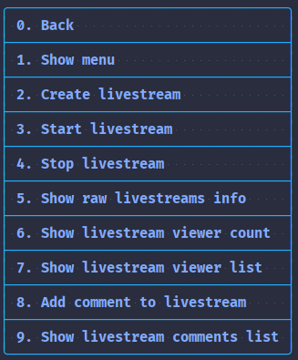
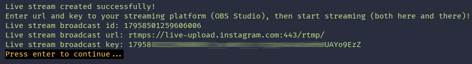
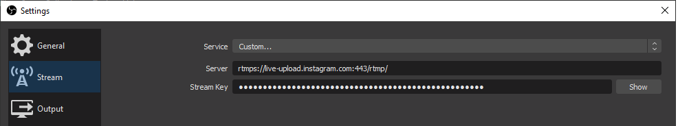

# Live stream

1. First create a live stream

2. Enter broadcast url and broadcast key into your broadcasting platform (like OBS Studio)

3. Start broadcasting both here and in your broadcasting platform
4. Enjoy!